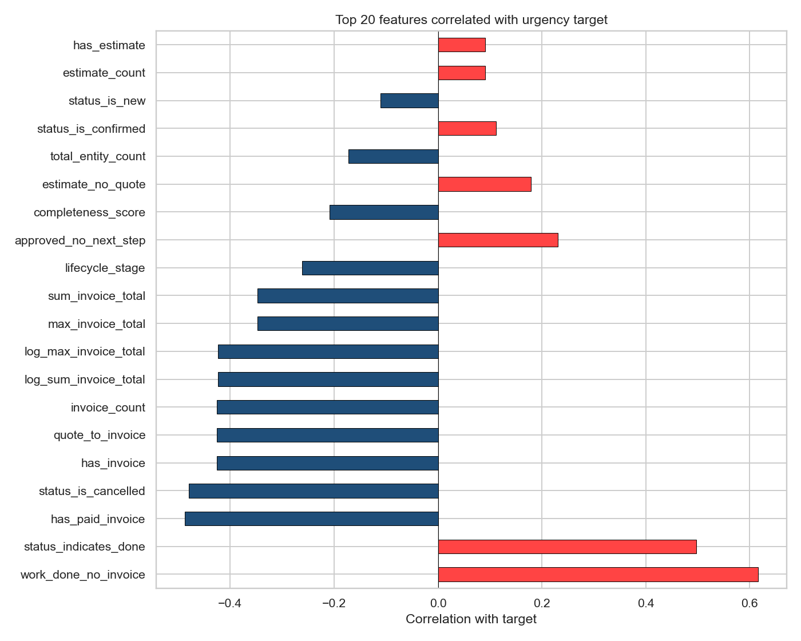
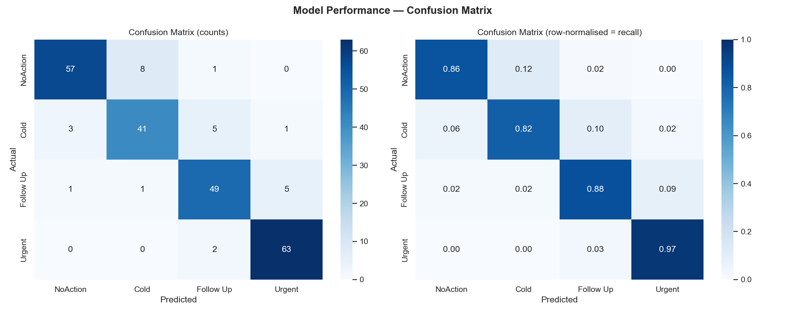
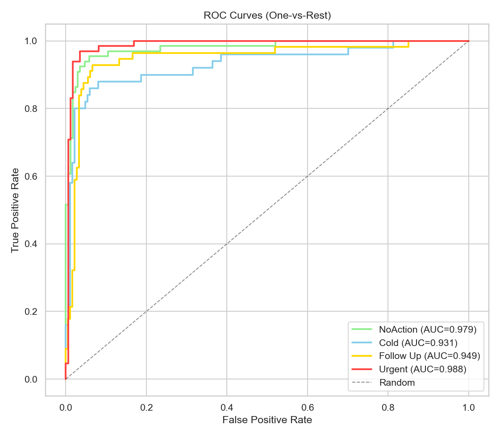
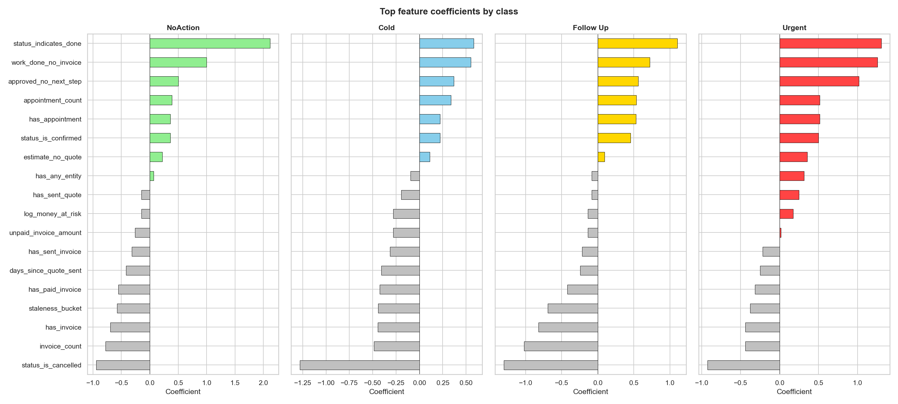
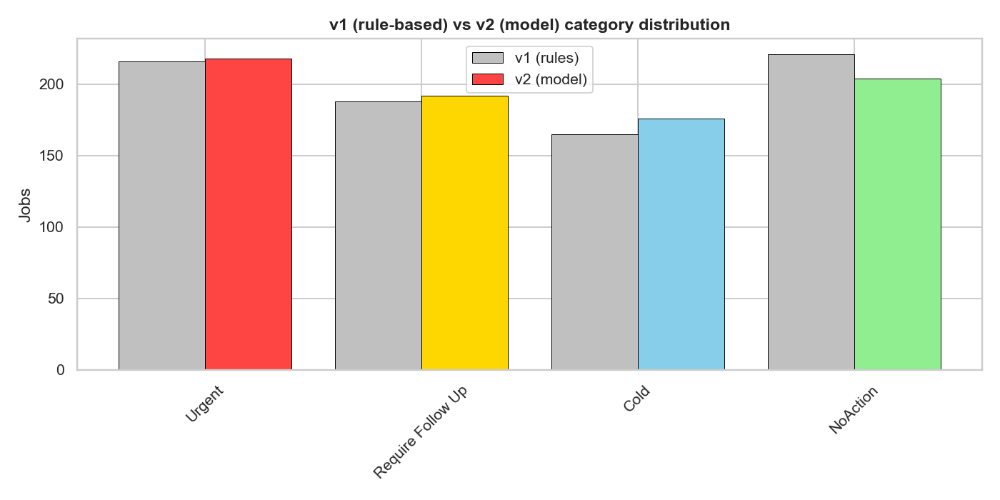
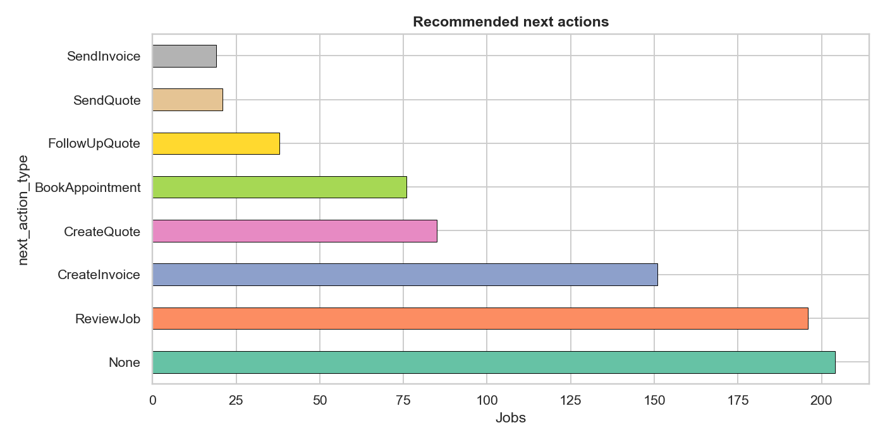

# Next Best Action for Jobs

An end-to-end machine-learning pipeline that scores tradie jobs by how much they
need attention and recommends the single **next best action** for each one
(send a quote, chase a payment, book an appointment, …).

It combines a **rule-based v1** (interpretable heuristics that generate labels)
with a **model-based v2** (multinomial logistic regression that learns feature
interactions the rigid rules miss), across a clean 5-stage pipeline.

> **Data note:** this repository runs on a **synthetic dataset** generated by
> `pipeline/00_generate_synthetic_data.py` — no real data from any company or
> system is included. The production version read six warehouse tables; here
> those are **generic placeholders** (`your_catalog.silver.*`, see
> `pipeline/common.py`) and the source rows are fabricated with realistic
> relationships. The purpose is to show the **methodology, queries, and sample
> output charts**. A small amount of documented label noise is injected so the
> example model isn't trivially perfect.

## The pipeline

| Stage | Script | What it does |
|-------|--------|--------------|
| 00 | `00_generate_synthetic_data.py` | Fabricate the 6 source tables (jobs, quotes, invoices, appointments, estimates, FE actions) |
| 01 | `01_data_extraction.py` | Load sources + apply the **v1 rule-based** categorisation (Urgent / Require Follow Up / Cold / NoAction) |
| 02 | `02_eda.py` | Profile the data — entity coverage, staleness, conversion funnel, engagement, class balance |
| 03 | `03_feature_engineering.py` | Build ~40 features across 7 groups (recency, frequency, financial, lifecycle, behavioural, BE & FE engagement) |
| 04 | `04_modelling.py` | Train a multinomial logistic regression, evaluate, interpret coefficients, score every job |
| 05 | `05_output.py` | Assign the next best action per job, summarise money at risk, per-account breakdown |

### Documentation

Each stage has a write-up (methodology, tables, diagrams) in [`docs/`](docs/):

- [01 — Data extraction + v1 labels](docs/01_data_extraction.md)
- [02 — Exploratory data analysis](docs/02_eda.md)
- [03 — Feature engineering](docs/03_feature_engineering.md) *(feature-group diagram + tables)*
- [04 — Modelling](docs/04_modelling.md)
- [05 — Output & deliverables](docs/05_output.md)

### The four categories

| Category | Meaning |
|----------|---------|
| **Urgent** | Needs action now (overdue invoice with work done, warm quote, work done but no invoice) |
| **Require Follow Up** | Stalling (quote sent no response, draft never sent, active but quiet 14–60 days) |
| **Cold** | Dormant 60+ days, or an old ghost lead with no engagement |
| **NoAction** | Complete, paid, cancelled, or a demo/test job |

## How to run

```bash
pip install -r requirements.txt

cd pipeline
python 00_generate_synthetic_data.py   # -> data/raw/*.csv
python 01_data_extraction.py           # -> data/interim/*.csv + v1 labels
python 02_eda.py                       # -> charts/02_*.png
python 03_feature_engineering.py       # -> feature matrix + charts/03_*.png
python 04_modelling.py                 # -> model scores + charts/04_*.png
python 05_output.py                    # -> final output + charts/05_*.png
```

Fully reproducible (fixed seeds).

## Sample output charts

Feature relationships and model behaviour (on synthetic data):

**Which features predict urgency**


**Model performance**



**What the model learned (coefficients per class)**


**Rule-based v1 vs model v2, and recommended actions**



EDA charts (entity coverage, staleness, conversion funnel, engagement, class
balance) are in `charts/02_*.png`.

## Method notes

- **Composite key.** Entity IDs are only unique within an account, so every key
  is `(account_id, entity_id)`.
- **Status lags reality.** A job's status often trails its actual state (a "New"
  job may already have sent quotes), so features cross-reference entities rather
  than trusting status alone.
- **Staleness is the strongest signal.** `days_since_last_activity` cleanly
  separates the categories; recency dominates the model.
- **Balanced class weights.** "Require Follow Up" is a minority class, so the
  model uses `class_weight="balanced"`.
- **v2 beyond v1.** The model is trained on the v1 rule labels but learns feature
  *interactions* rigid IF/THEN thresholds miss — the interesting cases are where
  v2 disagrees with v1.
