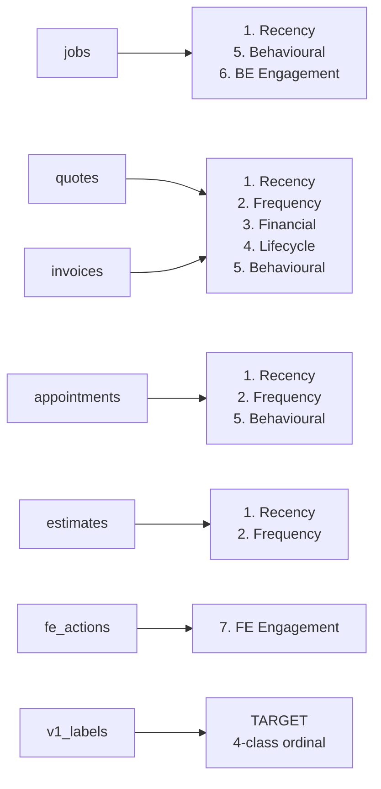

# 03 — Feature Engineering

Builds a model-ready feature matrix — **one row per job** with ~40 engineered
features across **7 groups**, plus the v1 rule-based label as the training
target.

## Source tables → feature categories

## Feature groups

| # | Group | Source | Example features |
|---|-------|--------|------------------|
| 1 | **Recency** | back-end | `days_since_created`, `days_since_last_activity`, `days_since_quote_sent`, `staleness_bucket` |
| 2 | **Frequency** | back-end | `quote_count`, `invoice_count`, `appointment_count`, `total_entity_count` |
| 3 | **Financial** | back-end | `max_quote_total`, `money_at_risk`, `log_overdue_amount`, `has_overdue_invoice` |
| 4 | **Lifecycle** | back-end | `has_quote`, `completeness_score`, `lifecycle_stage`, entity-presence flags |
| 5 | **Behavioural** | back-end | `has_emergency_language`, `status_mismatch`, `work_done_no_invoice`, `approved_no_next_step` |
| 6 | **BE Engagement** | back-end | `has_customer`, `estimate_to_quote`, `quote_to_invoice`, `lead_source_*` |
| 7 | **FE Engagement** | front-end (gold) | `fe_total_action_count`, `fe_action_velocity`, `fe_quote_sent_count`, `fe_days_since_last_action` |

## Summary

| Category | Sources | # features |
|----------|---------|-----------:|
| Recency | jobs, quotes, invoices, appointments, estimates | 6 |
| Frequency | quotes, invoices, appointments, estimates | 6 |
| Financial | quotes, invoices | 16 |
| Lifecycle | quotes, invoices (+ frequency flags) | 11 |
| Behavioural | jobs, quotes, invoices, appointments | 13 |
| BE Engagement | jobs | 8 |
| FE Engagement | fe_actions | 13 |
| **Total** | | **~73 features + target** |

## Design notes

- **Composite keys.** Entity IDs are only unique within an account, so every key
  is `(account_id, entity_id)` and all joins go through `job_key`.
- **Log transforms.** Financial amounts are heavily right-skewed, so quote /
  invoice / money-at-risk totals get `log1p` versions for the model.
- **FE features are account-level.** Front-end actions are aggregated per account
  and then joined to every job in that account.
- **Target.** The v1 category is encoded ordinally: `NoAction=0, Cold=1,
  Require Follow Up=2, Urgent=3`.

See [`pipeline/03_feature_engineering.py`](../pipeline/03_feature_engineering.py)
for the implementation, and `charts/03_*.png` for the feature/target correlation
and heatmap.
